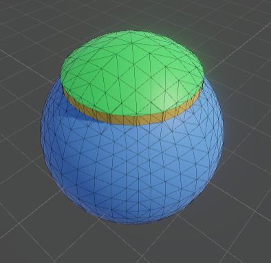

# Procedural Geometry for Unity

This is an unfinished mesh manipulation package for Unity.

## Functionalities

* Convex faces with an arbitrary number of vertices
* Faces, vertices and edge adjacency
* UVs
* Primitive shapes
	* quads
	* cubes
	* grids (squares and triangles)
	* cylinders
    * Cube sphere
	* UV sphere
* Extrusion
* Sharp/Smooth normals
* Marching triangles algoritm

## Example

```cs
using OG.ProceduralGeometry;
using System.Collections.Generic;
using UnityEngine;

public class Planet : MonoBehaviour
{
    public MeshFilter meshFilter;
    void Start()
    {
        if (meshFilter == null) return;

        ProceduralGeometry Geom = ProceduralGeometry.CubeSphere(20f, 10);

        HashSet<Face> IslandFaces = new();
        HashSet<Face> SeaFaces = new();

        Geom.MarchingTriangles(vertex => vertex.position.y - 15f, out SeaFaces, out IslandFaces, out _);

        HashSet<Face> CliffFaces = Geom.Extrude(IslandFaces, 2f * Vector3.up);

        Geom.AutoSmooth();

        foreach (Face face in IslandFaces) face.SetUV(new Vector2(0.25f, 0.75f));
        foreach (Face face in CliffFaces) face.SetUV(new Vector2(0.25f, 0.25f));
        foreach (Face face in SeaFaces) face.SetUV(new Vector2(0.75f, 0.75f));

        meshFilter.mesh = Geom.GenerateMesh();
    }
}
```



## Performances

This runs on a single thread on the CPU. The code is currently not very optimized and create a lot of garbage.

Small meshes can be generated in realtime without causing fluidity problems (a few hundred of triangles).

Bigger meshes are possible but will cause the game to "freeze" for a few seconds. So the package can be used to generate scenes during the loading screen for example.

This is not suited for expensive things like infinite realtime open world generation.